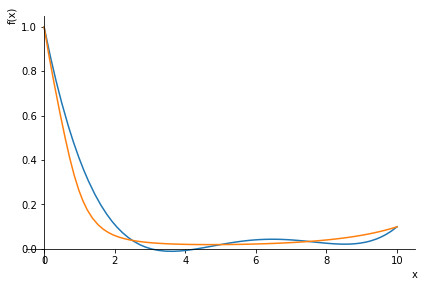
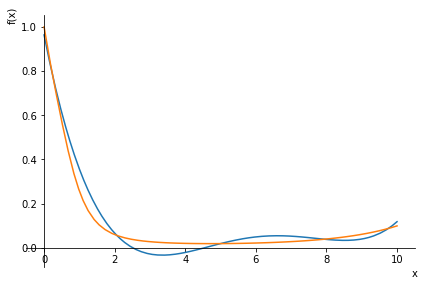
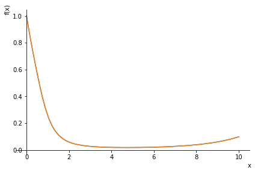

# Численная интерполяция
**Вариант 27**

*Выполнила Суслова Ирина, группа Б20-215*
Основной файл - methods_lab_1.ipynb

Графики (синий - построенная функция, оранжевый - исходная):
| n | Равномерная сетка | Узлы Чебышева | 
| :- | :- | :- |
| 5 | ошибка: **0.140047499951588** | ошибка: **0.0976262256790428** |
| 50 | ошибка: **0.00589034318085513** | ошибка: **3.53400772534762e-8** |

При больших n ошибка начинает возрастать, что связано с хранением чисел в памяти компьютера (машинный эпсилон).
Например, при **n = 100** и равномерном разбиении ошибка составляет: **90328954270.7554**

Ниже приведен код программы.
```
from sympy import *
import numpy as np
import matplotlib.pyplot as plt

# весь алгоритм в одной функции, возвращающей максимальную ошибку, границы для x (задаются в начале функции), и сами функции (исходную и построенную) для простоения графика
def count_diff(current_n, current_is_even):
    # f(x) = cosh( x ) / ( x**5 + x**4 + x**3 + x**2 + x + 1 )
    # [0, 10]
    
    # объявление функций
    x = symbols('x')
    f_x = cosh(x) / ( x**5 + x**4 + x**3 + x**2 + x + 1 )
    a = 0
    b = 10
    h = 0
    
    # определение разбиения
    coords = []
    if current_is_even:
        h = (b - a) / (current_n - 1)
        for i in range(current_n):
            coords.append(a + i * h)
    else:
        for i in range(current_n):
            coords.append(((b + a) / 2 + (b - a) / 2 * cos(pi * (2 * i + 1) / 2 / current_n)).n())
    values = []
    for i in range(len(coords)):
        values.append(f_x.subs(x, coords[i]).n())
    
    # интерполяция (полином Лагранжа)
    F_x = 0
    for i in range(len(values)):
        curr = values[i]
        for k in range(len(values)):
            if k != i:
                curr *= (x - coords[k]) / (coords[i] - coords[k])
        F_x += curr
        
    # поиск наибольшего отколнения (в серединах отрезков)
    check_coords = []
    for i in range(len(coords) - 1):
        check_coords.append((coords[i + 1] + coords[i]) / 2)
    check_values = []
    for i in range(len(check_coords)):
        check_values.append(f_x.subs(x, check_coords[i]).n())
    current_values = []
    for i in range(len(check_coords)):
        current_values.append(F_x.subs(x, check_coords[i]).n())
    abses = []
    for i in range(len(check_coords)):
        abses.append(np.absolute(check_values[i] - current_values[i]))
    return [max(abses), (x, a, b), F_x, f_x]

# вызов функции, пример использования
result = count_diff(50, False)
print(result[0])
plot(result[2], result[3], result[1])
```
