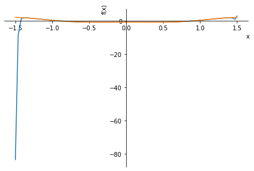

# Лабораторная работа 2. Численное дифференцирование
**Вариант 27**

*Выполнила Суслова Ирина, группа Б20-215*

Основной файл - methods_lab_2.ipynb

Графики (синий - построенная функция, оранжевый - исходная):
| n | Центральная разностная производная | Правая разностная производная | Вторая производная, 2ой порядок точности | Вторая производная, 4ый порядок точности |
| :- | :- | :- | :- | :- |
| 10 | ошибка: **0.0743546126324895** | ошибка: **0.187361703419736** | ошибка: **0.0693428064872930** | ошибка: **0.0129728850484925** |
| 14 | ошибка: **0.0321564249655585** | ошибка: **0.170728198758813** | ошибка: **0.0357940352077871** | ошибка: **0.00593912865012047** |
| 50 | ошибка: **0.00276129894256005** | ошибка: **0.0574827309947366* | ошибка: **0.00661477690773915** | ошибка: **0.000871076762984924** |
