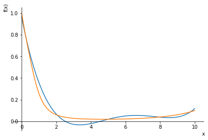
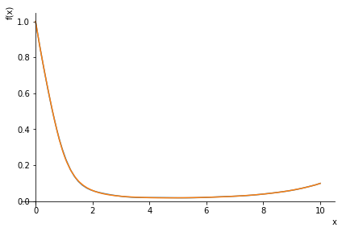

# Численная интерполяция
**Вариант 27**
*Выполнила Суслова Ирина, группа Б20-215*

```
from sympy import *
import numpy as np
import matplotlib.pyplot as plt

# f(x) = cosh( x ) / ( x**5 + x**4 + x**3 + x**2 + x + 1 )
# [0, 10]

# параметры (можно изменять)
n = 5             # количество узлов интерполяции
is_even = False    # выбор узлов интерполяции

# объявление функций
a = 0
b = 10
h = 0
x = symbols('x')
f_x = cosh(x) / ( x**5 + x**4 + x**3 + x**2 + x + 1 )

# определение разбиения
coords = []
if is_even:
    h = (b - a) / (n - 1)
    print("h: ", h)
    for i in range(n):
        coords.append(a + i * h)
else:
    for i in range(n):
        coords.append(((b + a) / 2 + (b - a) / 2 * cos(pi * (2 * i + 1) / 2 / n)).n())

values = []
for i in range(len(coords)):
    values.append(f_x.subs(x, coords[i]).n())
    
# интерполяция (полином Лагранжа)
F_x = 0
for i in range(len(values)):
    curr = values[i]
    for k in range(len(values)):
        if k != i:
            curr *= (x - coords[k]) / (coords[i] - coords[k])
    F_x += curr
    
# построение графика (ниже)
# синий - F_x
# оранжевый - f_x
plot(F_x, f_x, (x, 0, 10))

# поиск наибольшего отколнения (в серединах отрезков)
check_coords = []
for i in range(len(coords) - 1):
    check_coords.append((coords[i + 1] + coords[i]) / 2)
check_values = []
for i in range(len(check_coords)):
    check_values.append(f_x.subs(x, check_coords[i]).n())
current_values = []
for i in range(len(check_coords)):
    current_values.append(F_x.subs(x, check_coords[i]).n())
squares = []
for i in range(len(check_coords)):
    squares.append((check_values[i] - current_values[i]) * (check_values[i] - current_values[i]))
max(squares)

# n = 5 - max(squares) = 0.0095308799403354
# n = 15 - max(squares) = 1.42377921567458⋅10e−5
```

|||
